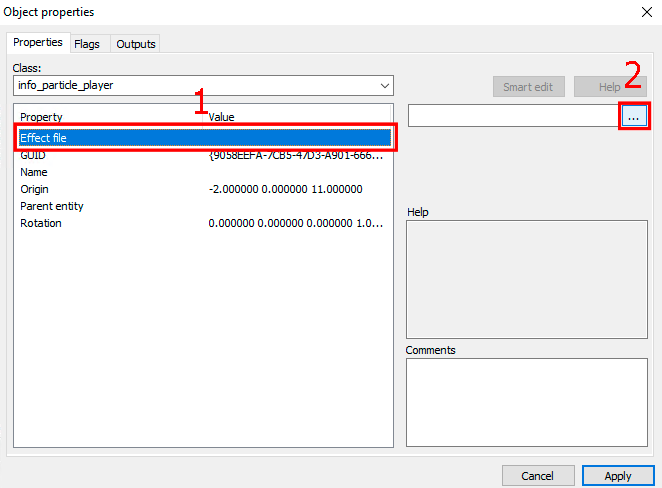
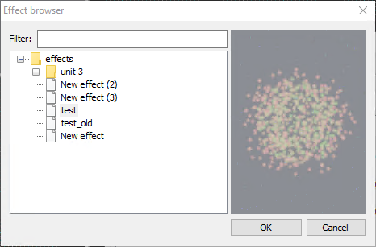

# Использование эффектов

## Добавление в мир

Для того, чтобы разместить эффект на уровне, создайте энтити [info_particle_player](/entities/info_particle_player.md). В окне свойств созданного энтити выберите параметр `Effect file` и нажмите кнопку обзора.

|  |
|-|
| Окно свойств info_particle_player |

После нажатия на кнопку откроется обозреватель эффектов. После выбора нужного эффекта он сразу начнет воспроизводиться объектом `info_particle_player`.

## Обозреватель эффектов

:::caution Not (yet) implemented feature

Некоторые функции, описанные в данном разделе, более не поддерживаются, либо начнут поддерживаться в будущем.

:::

|  |
|-|
| Обозреватель эффектов |

В обозревателе эффектов отображается дерево всех созданных в проекте эффектов. Над деревом отображается строка поиска, позволяющая отфильтровать список эффектов.

Все элементы дерева поддерживают команды контекстного меню. Внутри папок можно создавать вложенные папки и эффекты. Эффекты можно переименовывать, [редактировать](editor) или удалять. При выделении эффекта в дереве, в правой области начнется его воспроизведение для возможности предпросмотра.
