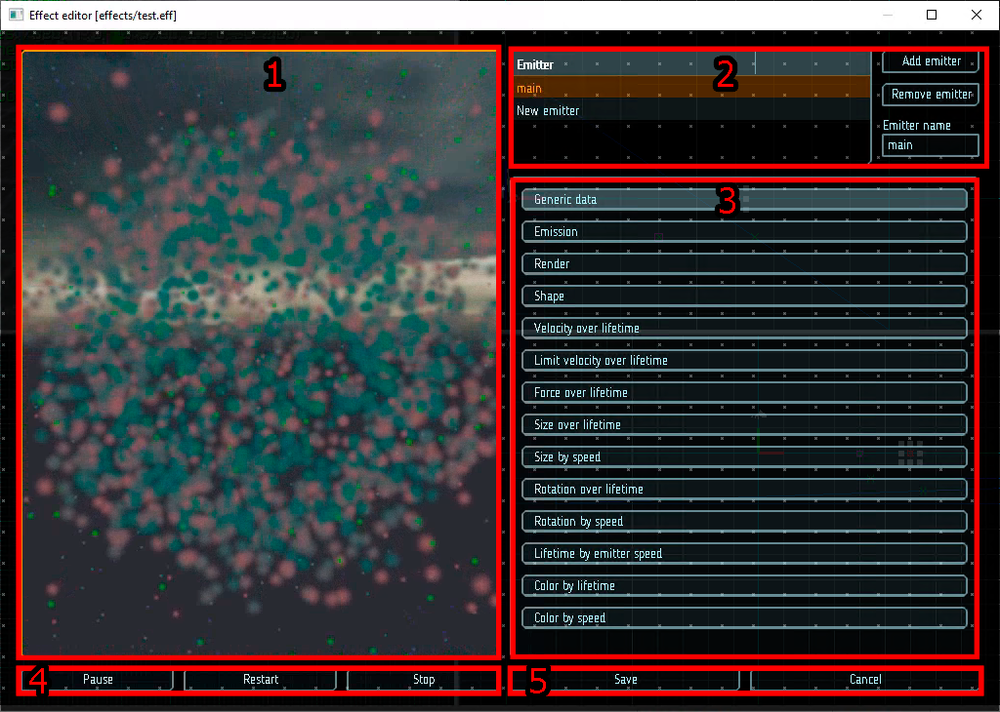

# Редактор эффектов

В этом документе мы познакомимся с интерфейсом редактора эффектов, рассмотрим его панели и инструменты.

Всего у редактора 5 панелей, общий вид представлен на изображении ниже.

|  |
|-|
| Редактор эффекта системы частиц |

### 1. Область предпросмотра

В этой области отображается редактируемый эффект. Положение камеры можно изменять, используя основную кнопку мыши. С использованием колесика камеру можно приближать и отдалять.

### 2. Управление эмиттерами

В этой области отображается список эмиттеров эффекта. Для выбора определенного эмиттера, нужно нажать на него основной кнопкой мыши. Выбранный эмиттер можно переименовать, используя тектосое поле `Emitter name`, либо удалить с помощью кнопки `Remove emitter`. Для добавления нового эмиттера в эффект служит кнопка `Add emitter`.

### 3. Область настроек эмиттера

В этой области находятся настройки выбранного эмиттера, сгруппированные по модулям. Подробное описание настроек каждого модуля можно найти в соответствуюшем разделе документации.

### 4. Кнопки управления воспроизведением

Данные кнопки предназначены для управления воспроизведением эффекта в области предпросмотра. Назначение:

* кнопка `Play`/`Pause` - запускает или приостанавливает воспроизведение эффекта;
* кнопка `Restart` - перезапускат эффект с начала;
* кнопка `Stop` - полностью останавливает воспроизведение эффекта.

### 5. Управление сохранением

Кнопка `Save` сохраняет текущий редактируемый эффект. Кнопка `Cancel` позволяет выйти из редактора эффекта без сохранения изменений на диск.
