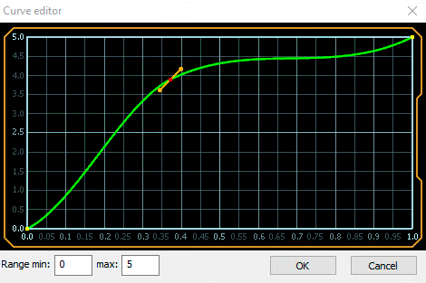

# Редактор кривых

Некоторые свойства эффектов могут изменяться с течением времени. Зависимость изменений задается с помощью кривых. В этом документе рассмотрен интерфейс редактора кривых. Вид редактора представлен на рисунке ниже.

|  |
|-|
| Редактор кривых |

Каждая кривая задается набором ключевых точек (_желтые_ на рисунке), которые можно перемещать с помощью мыши. При выделении точки (_красная_ на рисунке), рядом с ней появляются маркеры (_оранжевые_), при их перемещении изменяется крутизна кривой в соответствующей окрестности точки. Выбранную точку можно удалять при помощи кнопки `Delete` на клавиатуре. Для добавления новой точки нужно дважды кликнуть в произвольное место на кривой.

В левой нижней части окна находятся поля настройки границ области значений кривой.

Все изменения начинают действовать мгновенно, что позволяет изменять настройки кривой и сразу видеть результат воздействия.

Для подтверждения изменений нажмите кнопку `Ok`.

Для отмены изменений нажмите кнопку `Cancel`. 
