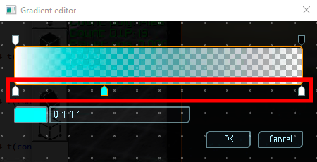
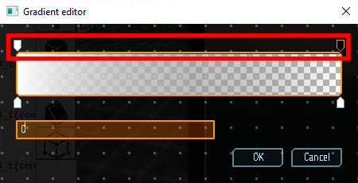

# Редактор градиентов

Некоторые цветовые свойства эффектов могут изменяться с течением времени. Зависимость изменений задается с помощью градиентов. В этом документе рассмотрен интерфейс редактора градиентов.

Градиент состоит из двух частей - градиент цвета и градиент прозрачности. Каждый градиент задается набором ключевых точек. На рисунке ниже показан общий вид редактора и выделена область ключевых точек градиента цвета.

|  |
|-|
| Редактор градиентоа цвета |

Ключевые точки могут быть перемещены с использованием основной кнопки мыши. Выделенную точку можно удалить с помощью кнопки `Delete` на клавиатуре. Для добавления новой точки нужно кликнуть основной кнопкой мыши в пустом месте области ключевых точек. При выделении ключевой точки, в нижней область появляется поле редактирования цвета. При клике на прямоугольник с цветом отобразится окно выбора цвета. Так же, цвет может быть изменен прямым вводом значений в текстовое поле.

Помимо цвета, градиент содержит настройки прозрачности. Область ключевых точек градиента прозрачности показана на рисунке ниже.

|  |
|-|
| Редактор градиентоа прозрачности |

Ключевые точки могут быть перемещены с использованием основной кнопки мыши. Выделенную точку можно удалить с помощью кнопки `Delete` на клавиатуре. Для добавления новой точки нужно кликнуть основной кнопкой мыши в пустом месте области ключевых точек. При выделении ключевой точки, в нижней область появляется поле редактирования прозрачности. Значение прозрачности варьируется от 0 - полностью прозрачный, до 1 - полностью непрозрачный.

Все изменения начинают действовать мгновенно, что позволяет изменять настройки градиента и сразу видеть результат воздействия.

Для подтверждения изменений нажмите кнопку `Ok`.

Для отмены изменений нажмите кнопку `Cancel`. 
