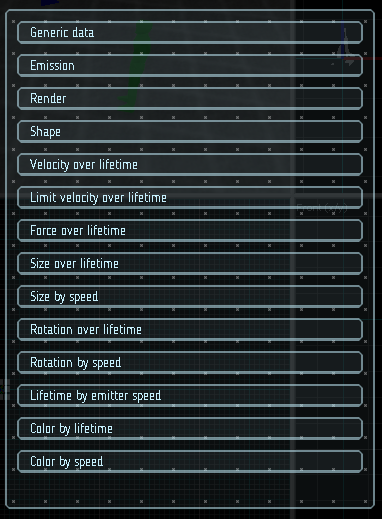

# Система частиц

Система частиц используется для создания визуальных эффектов посредством моделирования и визуализации множества небольших спрайтов, называемых частицами. С помощью системы можно создать такие эффекты, как огонь, дым или жидкости.

## Организация

Система частиц управляет множеством _эффектов_. Каждый эффект содержит один или несколько _эмиттеров_. Каждый эмиттер имеет множество свойств, разделенных на логические блоки -- _модули_, и может быть настроен независимо от других. Документация по каждому модулю вынесена в отдельную страницу.

|  |
|-|
| Модули системы частиц |

Для разворачивания или сворачивания модуля нужно нажать на полосу с названием модуля. Некоторые модули могут быть включены или отключены.
