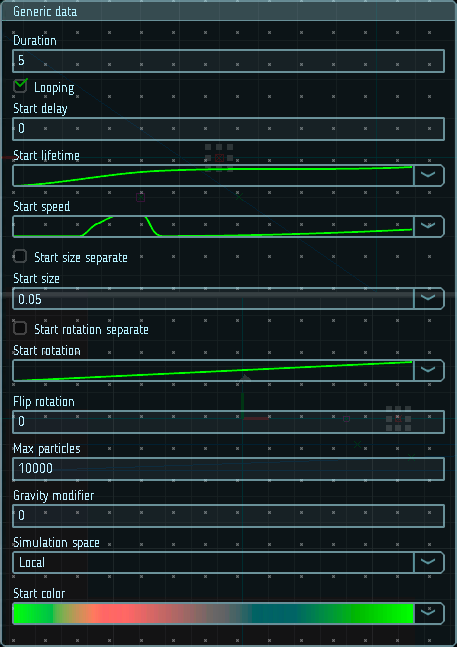

# Основные настройки

Данный модуль содержит основные настройки, многие из которых задают начальное состояние порождаемых частиц. 

|  |
|-|
| Модуль основных настроек |

## Свойства

| Название                | Описание
|-------------------------|---------
| Duration                | Общее время работы эмиттера (в секундах)
| Looping                 | Если включено - эмиттер будет перезапускаться после истечения времени работы
| Start delay             | Задержка перед началом работы эмиттера после запуска эффекта (в секундах)
| Start lifetime          | Начальное время жизни частицы (в секундах)
| Start speed             | Начальная скорость частицы (м/с)
| Start size              | Начальный размер частицы (в метрах)
| Flip rotation           | Процент частиц, повернутых в обратном направлении (0-1)
| Gravity modifier        | Множитель, применяемый к силе гравитации, действующей на частицы
| Max particles           | Максимальное количество частиц, которые могут существовать одновременно
| Simulation space        | Выбор пространства, в котором будет осуществлятся симуляция. Это может быть глобальное или локальное пространство
| Start color             | Начальный цвет частицы
| Start rotation          | Начальный угол поворота частицы (в градусах)
| Start rotation separate | Если включено, то начальный угол поворота можно задавать отдельно по трем осям
| Start rotation X        | Начальный угол поворота частицы вокруг оси x (в градусах)
| Start rotation Y        | Начальный угол поворота частицы вокруг оси y (в градусах)
| Start rotation Z        | Начальный угол поворота частицы вокруг оси z (в градусах)
| Start size separate     | Если включено, то начальный размер частицы можно задавать отдельно по трем осям
| Start size X            | Начальный размер частицы по оси x (в метрах)
| Start size Y            | Начальный размер частицы по оси y (в метрах)
| Start size Z            | Начальный размер частицы по оси z (в метрах)

	