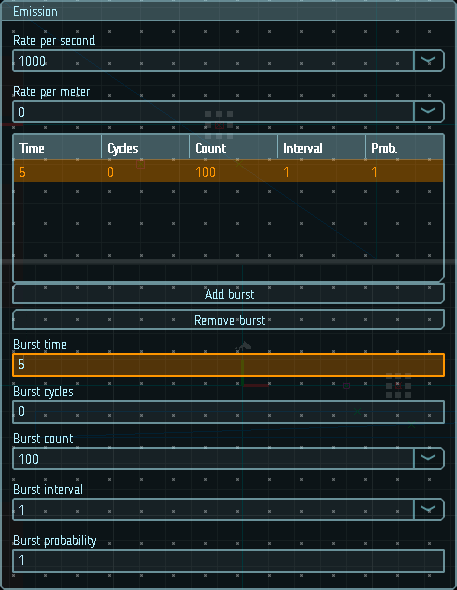

# Эмиссия

Настройки данного модуля контролируют скорость и время эмиссии новых частиц. Скорость эмиссии может быть постоянной, а может изменяться с течением времени. 

Если задано свойство `Rate per meter`, заданное количество частиц будет порождаться при движении эмиттера. Это может быть полезно для симуляции частиц, которые порождаются движением объектов, например, пыль из под колес автомобиля.

Если задано свойство `Rate per second`, то заданное количество частиц будет создаваться ежесекундно, независимо от движения эмиттера.

|  |
|-|
| Модуль эмиссии |

## Свойства

| Название        | Описание
|-----------------|---------
| Rate per second | Количество частиц, порождаемых в секунду
| Rate per meter  | Количество частиц, порождаемых на метр перемещения эмиттера
| Bursts          | Burst - событие, которое порождает множество частиц. С помощью следующих настроек можно создавать частицы в нужные моменты времени:
| - Time          | Момент в секундах, с начала работы эффекта, в который произойдет эмиссия
| - Cycles        | Количество повторений. 0 - неограниченно
| - Probability   | Вероятность порождения частиц (0-1)
| - Count         | Количество порождаемых частиц
| - Interval      | Время в секундах между повторениями
