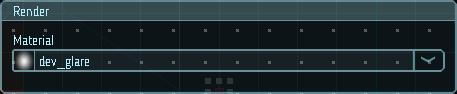

# Отрисовка

Свойства модуля отрисовки определяют, как частицы будут выглядеть.

|  |
|-|
| Модуль отрисовки |

## Свойства

| Название        | Описание
|-----------------|---------
| Material        | Материал, используемый при отрисовке частиц
