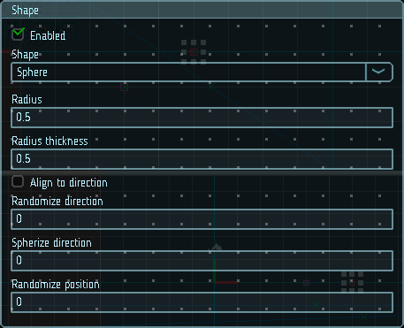
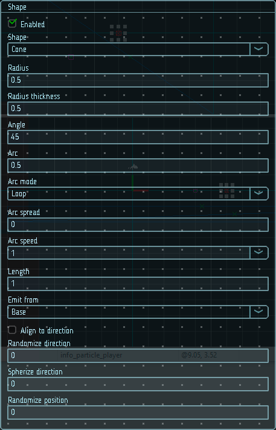
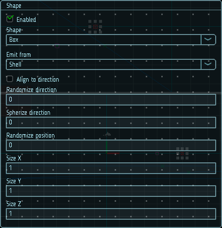
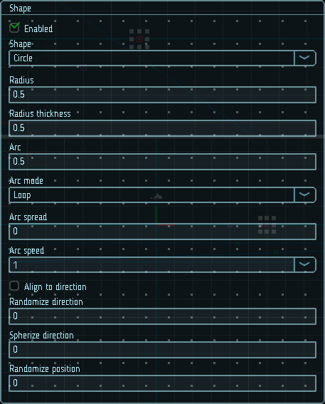
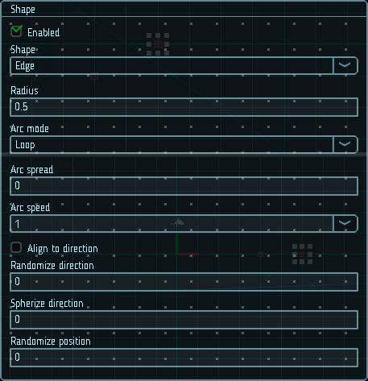
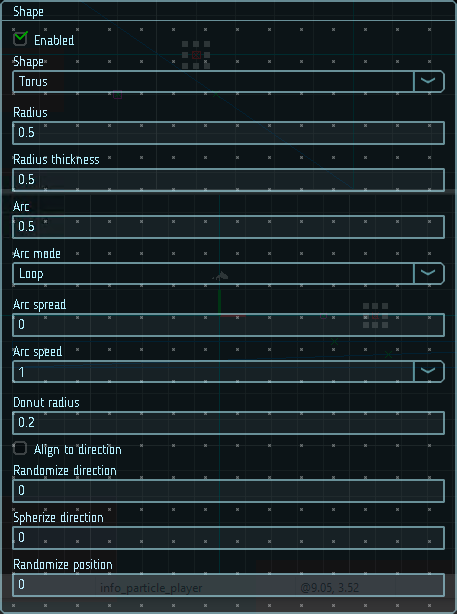
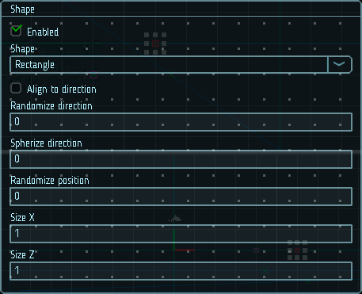

# Форма

Модуль формы определяет форму объема или поверхности, из которого будут испускаться частицы, а так же их начальное направление их скорости. Параметр `Shape` определяет форму эмиттирующего объема. От выбранной формы зависит набор остальных параметров модуля.

Все формы имеют параметры, которые определяют их размеры, например радиус для сферы. От формы зависит направление начальной скорости. Например, для сферы частицы испускаются во все стороны от центра сферы, а конус испускает расходящийся поток частиц.

## Возможные формы

В этом разделе описаны свойства для каждой формы.

### Сфера, полусфера

* Сфера - равномерно испускает частицы во всех направлениях от центра.
* Полусфера - равномерно испускает частицы в верхней полусфере от центра.

:::note

Сфера и полусфера определяются одним и тем же набором параметров.

:::

|  |
|-|
| Параметры сферы и полусферы |

#### Свойства

| Название            | Описание
|---------------------|---------
| Radius              | Радиус сферы
| Radius thickness    | Пропорция объема, испускающего частицы. 0 - частицы испускаются только с поверхности, 1 - по всему объему. Промежуточные значения задают соотношение испускающего объема к всему объему формы.
| Arc                 | Угловая пропорция дуги от полного круга, используемая для излучения.
| Mode                | Режим распределения частиц вдоль дуги формы. <ul><li>`Random` - частицы генерируются случайно вдоль дуги;</li><li>`Loop` - частицы генерируются последовательно вдоль дуги. При достижении конца дуги, генерация начинается сначала;</li><li>`Ping-pong` - частицы генерируются последовательно вдоль дуги. При достижении конца дуги, генерация продолжается в обратном направлении;</li><li>`Burst spread` - частицы генерируются равномерно вдоль дуги.</li></ul>
| Spread              | Интервалы вдоль дуги, на которых могут генерироваться частицы. 0 - генерация по всей дуге. 0.1 - на интервалах, длиной в 10% дуги.
| Speed               | Скорость, с которой точка испускания частиц движется по дуге. Этот параметр доступен только для режимов `Mode` отличных от `Random`
| Align to direction  | Повернуть частицы по их начальному направлению. Например, это может использоваться для симуляции искр, вылетающих при столкновении объектов. При необходимости поворот можно переопределить с помощью параметра `Start rotation` из основных настроек.
| Randomize direction | Коэффициент случайности направления. 0 - направление не меняется, 1 - направление полностью случайно.
| Spherize direction  | Коэффициент сферичности направления. 0 - направление не меняется, 1 - частица движется от центра эмиттера.
| Randomize position  | Сместить частицу на случайное расстояние, не превыщающее заданное этим параметром. 0 - не применяет смещение.

### Конус

Испускает частицы из вершины или объема конуса.

|  |
|-|
| Параметры конуса |

#### Свойства

| Название            | Описание
|---------------------|---------
| Angle               | Угол наклона стороны конуса. При 0 - конус вырождается в цилиндр, при 90 - в плоский диск.
| Radius              | Радиус основания конуса с узкой стороны.
| Radius thickness    | Пропорция объема, испускающего частицы. 0 - частицы испускаются только с поверхности, 1 - по всему объему. Промежуточные значения задают соотношение испускающего объема к всему объему формы.
| Arc                 | Угловая пропорция дуги от полного круга, используемая для излучения.
| Mode                | Режим распределения частиц вдоль дуги формы. <ul><li>`Random` - частицы генерируются случайно вдоль дуги;</li><li>`Loop` - частицы генерируются последовательно вдоль дуги. При достижении конца дуги, генерация начинается сначала;</li><li>`Ping-pong` - частицы генерируются последовательно вдоль дуги. При достижении конца дуги, генерация продолжается в обратном направлении;</li><li>`Burst spread` - частицы генерируются равномерно вдоль дуги.</li></ul>
| Spread              | Интервалы вдоль дуги, на которых могут генерироваться частицы. 0 - генерация по всей дуге. 0.1 - на интервалах, длиной в 10% дуги.
| Speed               | Скорость, с которой точка испускания частиц движется по дуге. Этот параметр доступен только для режимов `Mode` отличных от `Random`
| Length              | Длина конуса. Применяется только при режиме излучения `Emit from` установленным в `Volume`
| Emit from           | Откуда испускать частицы: из основания `Base`, или по всему объему `Volume`
| Align to direction  | Повернуть частицы по их начальному направлению. Например, это может использоваться для симуляции искр, вылетающих при столкновении объектов. При необходимости поворот можно переопределить с помощью параметра `Start rotation` из основных настроек.
| Randomize direction | Коэффициент случайности направления. 0 - направление не меняется, 1 - направление полностью случайно.
| Spherize direction  | Коэффициент сферичности направления. 0 - направление не меняется, 1 - частица движется от центра эмиттера.
| Randomize position  | Сместить частицу на случайное расстояние, не превыщающее заданное этим параметром. 0 - не применяет смещение.

### Параллелепипед

Испускает частицы из ребер, граней или объема параллелепипеда.

|  |
|-|
| Параметры параллелепипеда |

#### Свойства

| Название            | Описание
|---------------------|---------
| Emit from           | Откуда испускать частицы: из ребер `Edge`, из граней `Shell` или по всему объему `Volume`
| Size                | Размеры параллелепипеда
| Align to direction  | Повернуть частицы по их начальному направлению. Например, это может использоваться для симуляции искр, вылетающих при столкновении объектов. При необходимости поворот можно переопределить с помощью параметра `Start rotation` из основных настроек.
| Randomize direction | Коэффициент случайности направления. 0 - направление не меняется, 1 - направление полностью случайно.
| Spherize direction  | Коэффициент сферичности направления. 0 - направление не меняется, 1 - частица движется от центра эмиттера.
| Randomize position  | Сместить частицу на случайное расстояние, не превыщающее заданное этим параметром. 0 - не применяет смещение.

### Круг

Испускает частицы из центра или площади круга. Частицы движутся в плоскости круга.

|  |
|-|
| Параметры круга |

#### Свойства

| Название            | Описание
|---------------------|---------
| Radius              | Радиус круга.
| Radius thickness    | Пропорция площади, испускающей частицы. 0 - частицы испускаются только с краю, 1 - по всей площади. Промежуточные значения задают соотношение испускающей площади к всей площади круга.
| Arc                 | Угловая пропорция дуги от полного круга, используемая для излучения.
| Mode                | Режим распределения частиц вдоль дуги формы. <ul><li>`Random` - частицы генерируются случайно вдоль дуги;</li><li>`Loop` - частицы генерируются последовательно вдоль дуги. При достижении конца дуги, генерация начинается сначала;</li><li>`Ping-pong` - частицы генерируются последовательно вдоль дуги. При достижении конца дуги, генерация продолжается в обратном направлении;</li><li>`Burst spread` - частицы генерируются равномерно вдоль дуги.</li></ul>
| Spread              | Интервалы вдоль дуги, на которых могут генерироваться частицы. 0 - генерация по всей дуге. 0.1 - на интервалах, длиной в 10% дуги.
| Speed               | Скорость, с которой точка испускания частиц движется по дуге. Этот параметр доступен только для режимов `Mode` отличных от `Random`
| Align to direction  | Повернуть частицы по их начальному направлению. Например, это может использоваться для симуляции искр, вылетающих при столкновении объектов. При необходимости поворот можно переопределить с помощью параметра `Start rotation` из основных настроек.
| Randomize direction | Коэффициент случайности направления. 0 - направление не меняется, 1 - направление полностью случайно.
| Spherize direction  | Коэффициент сферичности направления. 0 - направление не меняется, 1 - частица движется от центра эмиттера.
| Randomize position  | Сместить частицу на случайное расстояние, не превыщающее заданное этим параметром. 0 - не применяет смещение.

### Отрезок

Испускает частицы из отрезка прямой.

|  |
|-|
| Параметры отрезка |

#### Свойства

| Название            | Описание
|---------------------|---------
| Radius              | Длина отрезка.
| Mode                | Режим распределения частиц вдоль отрезка. <ul><li>`Random` - частицы генерируются случайно вдоль отрезка;</li><li>`Loop` - частицы генерируются последовательно вдоль отрезка. При достижении конца отрезка, генерация начинается сначала;</li><li>`Ping-pong` - частицы генерируются последовательно вдоль отрезка. При достижении конца отрезка, генерация продолжается в обратном направлении;</li><li>`Burst spread` - частицы генерируются равномерно вдоль отрезка.</li></ul>
| Spread              | Интервалы вдоль отрезка, на которых могут генерироваться частицы. 0 - генерация по всему отрезку. 0.1 - на интервалах, длиной в 10% отрезка.
| Speed               | Скорость, с которой точка испускания частиц движется по отрезку. Этот параметр доступен только для режимов `Mode` отличных от `Random`
| Align to direction  | Повернуть частицы по их начальному направлению. Например, это может использоваться для симуляции искр, вылетающих при столкновении объектов. При необходимости поворот можно переопределить с помощью параметра `Start rotation` из основных настроек.
| Randomize direction | Коэффициент случайности направления. 0 - направление не меняется, 1 - направление полностью случайно.
| Spherize direction  | Коэффициент сферичности направления. 0 - направление не меняется, 1 - частица движется от центра эмиттера.
| Randomize position  | Сместить частицу на случайное расстояние, не превыщающее заданное этим параметром. 0 - не применяет смещение.

### Тор

Испускает частицы из тора. Частицы движутся по направлению из кольца тора.

|  |
|-|
| Параметры тора |

#### Свойства

| Название            | Описание
|---------------------|---------
| Radius              | Радиус всего тора.
| Donut radius        | Радиус внутреннего сечения тора.
| Radius thickness    | Пропорция объема, испускающего частицы. 0 - частицы испускаются только с поверхности, 1 - по всему объему. Промежуточные значения задают соотношение испускающего объема к всему объему формы.
| Arc                 | Угловая пропорция дуги от полного круга, используемая для излучения.
| Mode                | Режим распределения частиц вдоль дуги формы. <ul><li>`Random` - частицы генерируются случайно вдоль дуги;</li><li>`Loop` - частицы генерируются последовательно вдоль дуги. При достижении конца дуги, генерация начинается сначала;</li><li>`Ping-pong` - частицы генерируются последовательно вдоль дуги. При достижении конца дуги, генерация продолжается в обратном направлении;</li><li>`Burst spread` - частицы генерируются равномерно вдоль дуги.</li></ul>
| Spread              | Интервалы вдоль дуги, на которых могут генерироваться частицы. 0 - генерация по всей дуге. 0.1 - на интервалах, длиной в 10% дуги.
| Speed               | Скорость, с которой точка испускания частиц движется по дуге. Этот параметр доступен только для режимов `Mode` отличных от `Random`
| Align to direction  | Повернуть частицы по их начальному направлению. Например, это может использоваться для симуляции искр, вылетающих при столкновении объектов. При необходимости поворот можно переопределить с помощью параметра `Start rotation` из основных настроек.
| Randomize direction | Коэффициент случайности направления. 0 - направление не меняется, 1 - направление полностью случайно.
| Spherize direction  | Коэффициент сферичности направления. 0 - направление не меняется, 1 - частица движется от центра эмиттера.
| Randomize position  | Сместить частицу на случайное расстояние, не превыщающее заданное этим параметром. 0 - не применяет смещение.

### Прямоугольник

Испускает частицы из прямоугольной области.

|  |
|-|
| Параметры прямоугольника |

#### Свойства

| Название            | Описание
|---------------------|---------
| Size                | Размеры прямоугольника
| Align to direction  | Повернуть частицы по их начальному направлению. Например, это может использоваться для симуляции искр, вылетающих при столкновении объектов. При необходимости поворот можно переопределить с помощью параметра `Start rotation` из основных настроек.
| Randomize direction | Коэффициент случайности направления. 0 - направление не меняется, 1 - направление полностью случайно.
| Spherize direction  | Коэффициент сферичности направления. 0 - направление не меняется, 1 - частица движется от центра эмиттера.
| Randomize position  | Сместить частицу на случайное расстояние, не превыщающее заданное этим параметром. 0 - не применяет смещение.
