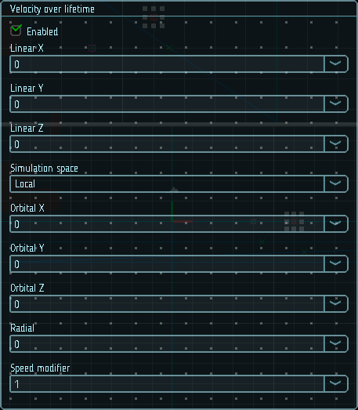

# Скорость по времени жизни

Настройки данного модуля позволяют изменять скорость движения частиц в зависимости от их времени жизни.

Кривые `Linear X`, `Linear Y`, `Linear Z` используются, чтобы создать частицы, которые движутся в заданном направлении.

Кривые `Orbital X`, `Orbital Y`, `Orbital Z` используются, чтобы вращать частицы вокруг центра эффекта. Свойство `Radial` позволяет отдалять или приближать частицы к центру вращения.

Параметр `Speed modifier` позволяет изменить скорость частиц без изменения их направления.

|  |
|-|
| Модуль скорости по времени жизни |

## Свойства

| Название          | Описание
|-------------------|---------
| Linear X, Y, Z    | Линейная скорость по осям X, Y и Z.
| Simulation space  | В каком пространстве применяется линейная скорость: в локальном, или в глобальном.
| Orbital X, Y, Z   | Угловая скорость вокруг осей X, Y и Z.
| Radial            | Скорость удаления (сближения) от центра эффекта.
| Speed modifier    | Модификатор скорости без изменения направления.
