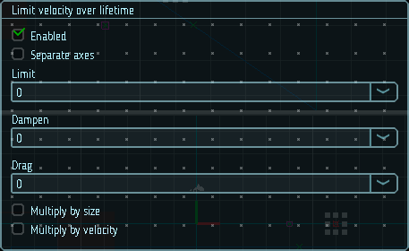

# Ограничение скорости по времени жизни

Данные параметры контролируют замедление частиц с течением их времени жизни. Это может использоваться для симуляции сопротивления среды, которое замедляет частицы. Например, частицы взрыва изначально разлетаются с большой скоростью, но затем быстро замедляются, пролетая по воздуху.

Параметр `Drag` используется для более точной, с точки зрения физики, симуляции сопротивления, так как позволяет применять различную силу к частицам разного размера или скорости.

|  |
|-|
| Модуль ограничения скорости по времени жизни |

## Свойства

| Название             | Описание
|----------------------|---------
| Separate axes        | Позволяет задать лимиты отдельно по каждой из осей.
| Simulation space     | В каком пространстве применяются ограничения: в локальном, или в глобальном.
| Limit                | Ограничение скорости движения частиц.
| Dampen               | Доля скорости частицы, которая используется для замедления при превышении заданного ограничения.
| Drag                 | Линейное замедление частицы.
| Multiply by size     | Если включено, частицы большего размера будут сильнее замедляться параметром `Drag`.
| Multiply by velocity | Если включено, частицы с большей скоростью будут сильнее замедляться параметром `Drag`.
