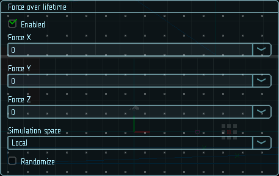

# Воздействие силы по времени жизни

На аэрозоли часто воздействуют силы при движении. Например, дым немного ускоряется, поднимаясь от огня, увлекаемый горячим воздухом вокруг него. Таких эффектов можно достичь, используя кривые для управления силой в течение времени жизни частиц. В предыдущем примере дым сначала будет ускоряться вверх, но по мере постепенного охлаждения поднимающегося воздуха сила будет уменьшаться. Густой дым от пожара может сначала ускоряться, затем замедляться по мере распространения и, возможно, даже начать опускаться на землю, если он не развеется в течение длительного времени.

|  |
|-|
| Модуль силы по времени жизни |

## Свойства

| Название             | Описание
|----------------------|---------
| Force X, Y, Z        | Сила, применяемая к частицам по каждой из осей.
| Simulation space     | В каком пространстве применяются силы: в локальном, или в глобальном.
| Randomize            | При случайном выборе значений между двумя кривыми или константами этот флаг заставляет систему выбирать новую случайную силу при каждом обновлении.
