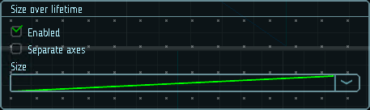

# Размер по времени жизни

Некоторые частицы обычно меняют размер по мере удаления от точки появления, например газы, огонь или дым. Дым со временем будет рассеиваться и занимать больший объем. Этого можно добиться, задав кривую для частиц дыма восходящей, увеличивающейся с возрастом частицы. Вы также можете еще больше усилить этот эффект, используя модуль [Цвет по времени жизни](13-color-lifetime.md), чтобы затемнить дым по мере его распространения.

В случае огненных шаров, образующихся при сжигании топлива, частицы пламени расширяются после появления, но затем тускнеют и сжимаются по мере того, как топливо израсходуется и пламя рассеивается. В этом случае кривая будет иметь восходящий «горб», который поднимается, а затем снова опускается до меньшего размера.

Для получения итогового размера частицы, значения, указанные на кривых, умножаются на начальный размер.

|  |
|-|
| Модуль размера по времени жизни |

## Свойства

| Название             | Описание
|----------------------|---------
| Separate axes        | Позволяет задать размеры отдельно по каждой из осей.
| Size                 | Модификатор размера частицы.
