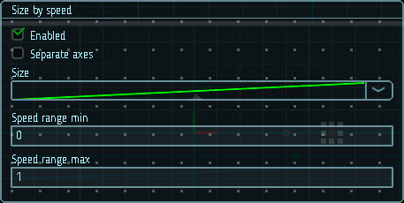

# Размер от скорости

Настройки данного модуля позволяют изменять размер частиц в зависимости от их скорости. 

Диапазон скорости определяет диапазон значений, к которым применяются кривые X (ширина), Y (высота) и Z (глубина). Быстрые частицы будут масштабироваться, используя значения на правом конце кривой, а более медленные частицы будут использовать значения на левом конце кривой. Например, если вы укажете диапазон скоростей от 5 до 10:
* при скорости меньше 5 размер частиц будет соответствовать самому левому значению кривой;
* при скорости больше 10 размер частиц будет соответствовать самому правому значению кривой;
* скорость от 5 до 10 задает размер частиц, определяемый точкой на кривой, соответствующей скорости. В этом примере скорость, равная 7.5, будет устанавливать размер в соответствии со средней точкой кривой.

|  |
|-|
| Модуль размера от скорости |

## Свойства

| Название             | Описание
|----------------------|---------
| Separate axes        | Позволяет задать размеры отдельно по каждой из осей.
| Size                 | Модификатор размера частицы.
| Speed range          | Границы диапазона скоростей, отображаемого на кривой.
