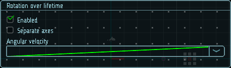

# Вращение по времени жизни

Эти параметры полезны, когда частицы представляют собой небольшие твердые объекты, такие как куски обломков от взрыва. Назначение случайных значений вращения сделает эффект более реалистичным, чем если бы частицы оставались в вертикальном положении во время полета. Случайные вращения также помогут разбавить регулярность частиц одинаковой формы (одна и та же текстура, повторяющаяся много раз, может быть очень заметной).

|  |
|-|
| Модуль вращения по времени жизни |

## Свойства

| Название             | Описание
|----------------------|---------
| Separate axes        | Позволяет задать вращение отдельно по каждой из осей.
| Angular velocity     | Угловая скорость.
