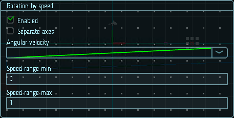

# Вращение от скорости

Эти параметры могут быть полезны, когда частицы представляют собой твердые объекты, движущиеся по земле, например камни от оползня. Скорость вращения частиц можно настроить пропорционально скорости, чтобы они реалистично катились по поверхности.

Диапазон скорости определяет диапазон значений, к которым применяются кривые `Angular velocity`. Быстрые частицы будут вращаться, используя значения на правом конце кривой, а более медленные частицы будут использовать значения на левой стороне кривой.

|  |
|-|
| Модуль вращения от скорости |

## Свойства

| Название             | Описание
|----------------------|---------
| Separate axes        | Позволяет задать размеры отдельно по каждой из осей.
| Angular velocity     | Угловая скорость вращения частицы.
| Speed range          | Границы диапазона скоростей, отображаемого на кривой.
