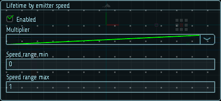

# Время жизни от скорости эмиттера

Настройки этого модуля позволяют задавать время жизни частиц в зависимости от скорости их эмиттера.

Диапазон скорости определяет диапазон значений, к которым применяется кривая `Multiplier`.

|  |
|-|
| Модуль времени жизни от скорости эмиттера |

## Свойства

| Название             | Описание
|----------------------|---------
| Multiplier           | Модификатор времени жизни частицы.
| Speed range          | Границы диапазона скоростей, отображаемого на кривой.
