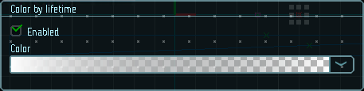

# Цвет по времени жизни

Настройки данного модуля позволяют изменять цвет частиц по времени их жизни. Например, яркие искры по мере охлаждения будут темнеть. 

Не менее важным является изменение прозрачности. Частицы очень часто сгорают, тускнеют или рассеиваются по мере того, как они достигают конца своей жизни (например, горячие искры, фейерверки и частицы дыма). Простой уменьшающийся градиент дает этот эффект.

При использовании свойства `Start color` этот модуль перемножает два цвета, чтобы получить окончательный цвет частицы.

|  |
|-|
| Модуль цвета по времени жизни |

## Свойства

| Название             | Описание
|----------------------|---------
| Color                | Градиент цвета частицы.
