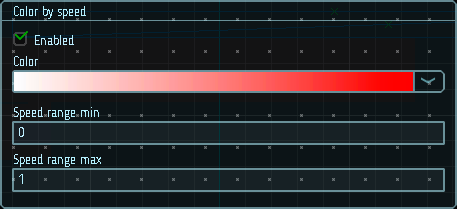

# Цвет от скорости

Горящие или светящиеся частицы (например, искры) имеют тенденцию гореть ярче, когда они быстро движутся в воздухе (например, когда искры подвергаются воздействию большего количества кислорода), но затем слегка тускнеют по мере замедления. Чтобы имитировать это, вы можете использовать градиент `Color`, который имеет белый цвет в верхней части диапазона скоростей и красный в нижней части (в примере с искрой более быстрые частицы будут отображаться белыми, а более медленные — красными).

|  |
|-|
| Модуль цвета от скорости |

## Свойства

| Название             | Описание
|----------------------|---------
| Color                | Градиент цвета частицы.
| Speed range          | Границы диапазона скоростей, отображаемого на градиенте.
